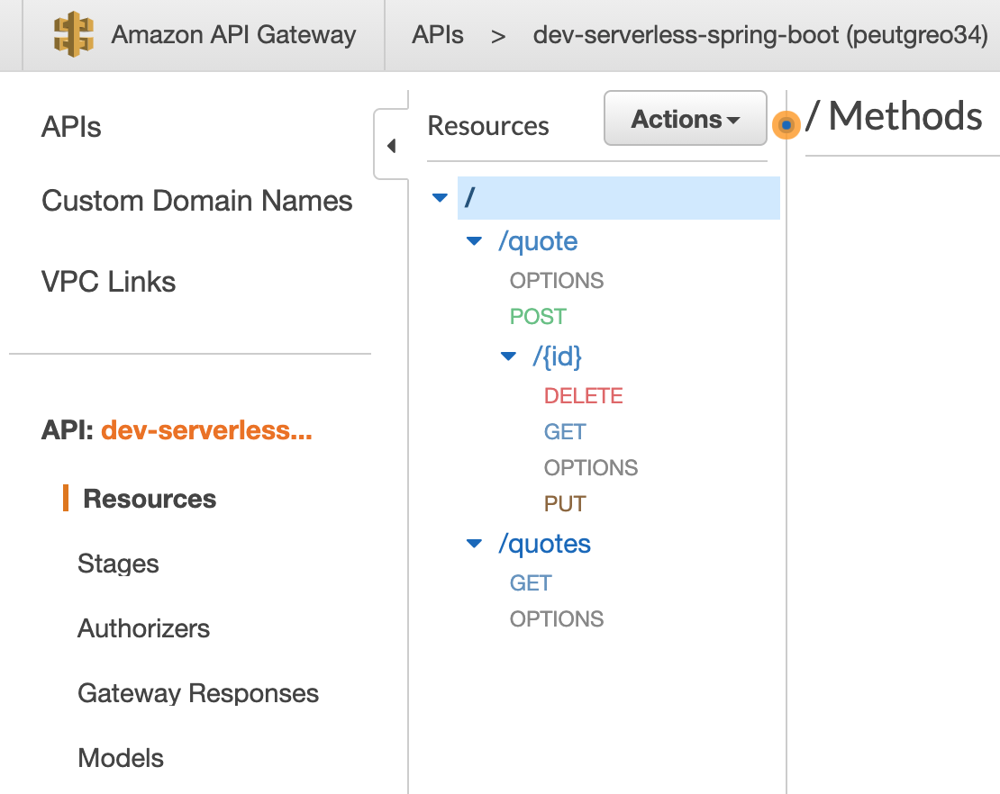

# Serverless Spring Boot Application
**Maintained by:** [Ahmet Caliskan](ahmet.cal@hotmail.com.tr)

# Introduction
Developed to introduce serverless framework over spring boot.
Check medium for more info:  https://ahmet-cal.medium.com/serverless-framework-with-spring-boot-aws-lambda-ed8d7902078a

## Architecture

## Tech Stack
 - Serverless Framework 
 - Spring Boot
 - Lambda
 - DynamoDB

## Pipeline
  - build
  - unitTes
  - integrationTest
  - featureTest
  - dev
  - staging
  - prod

Note: CI Stages are running by default but CD Stages configured as manual.

## Demo API

More API info could be found on swagger-ui by running locally and navigate http://localhost:8080/swagger-ui.html

## Local Development
### Preconditions
 - aws cli
 - npm
 - Serverless Framework

### Build
 - gradle build
 
### Deploy 
 - sls deploy --stage dev

### Destroy
 - sls remove --stage dev
